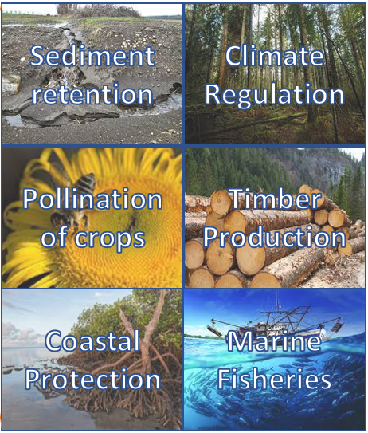

`global_invest` is the ecosystem-service module of the Earth-Economy Devstack. For each service it
produces, from the same source files, both a Gross Ecosystem Product (GEP) valuation and an NGFS
scenario shock.

The standard version of [InVEST](https://naturalcapitalalliance.stanford.edu/software/invest),
provided by the Natural Capital Project, is a set of tools for quantifying the values of natural
capital in clear, credible, and practical ways. InVEST enables decision-makers to assess the
trade-offs associated with alternative management choices and to identify the policies and practices
that can best balance human needs with environmental sustainability. It is designed to be accessible
to a broad audience, including conservation organizations, governments, development banks, academics,
and the private sector, and comprises an easy-to-use
[graphical interface](https://naturalcapitalalliance.stanford.edu/software/invest) as well as direct
access to the [Python library](https://github.com/natcap/invest) for advanced users.

Typical InVEST applications looked at individual watersheds or small administrative regions. Starting
with [Chaplin-Kramer et al. (2019)](https://www.science.org/doi/full/10.1126/science.aaw3372),
however, a series of global applications of InVEST have developed. These applications have sometimes
used the standard InVEST Python library, but in most cases custom versions were created to enable
calculation of the models globally, which was challenging for both computation and data reasons. The
term **Global InVEST** refers informally to the multiple code repositories behind these applications;
this module is where they are being organized and standardized.

The three main sources for Global InVEST are:

- Nature's Contributions to People: [Chaplin-Kramer et al. (2019)](https://www.science.org/doi/full/10.1126/science.aaw3372)
- GTAP-InVEST: [Johnson et al. (2023)](https://www.pnas.org/doi/10.1073/pnas.2220401120)
- Nature's Frontiers: [Damania et al. (2023)](https://www.worldbank.org/en/publication/natures-frontiers)

## Where to go next

- The [overview slide deck](overview.qmd) is a reveal.js presentation summarising the module: what
  each service produces, the numbers it currently reports, and the open questions.
- Each service documents its own method next to its code, in
  `global_invest/<service>/<service>_method.qmd`. Those pages are published on the website under
  Models → Global InVEST.

## Installation

`global_invest` installs as part of the devstack. Follow the
[installation guide](https://justinandrewjohnson.com/earth_economy_devstack/installation.html) to get
`global_invest` and `hazelbean` into your workspace.
