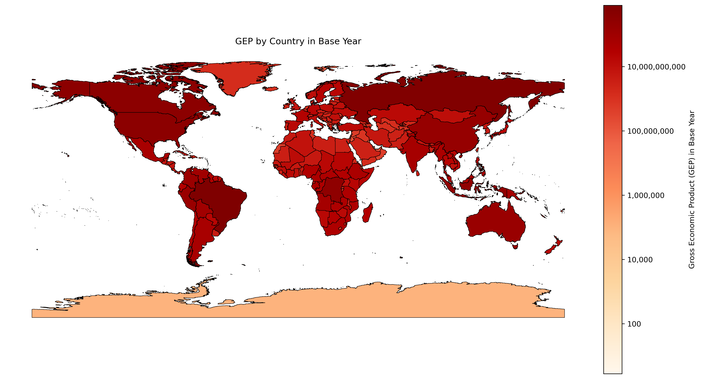

# Motivation

## Nature is invisible in the accounts

- Ecosystems supply services the economy depends on, from pollination and soil retention to coastal protection and carbon storage, yet none of them appear in standard national accounts.
- Unmeasured, their loss shows up later as lower yields and higher damages.
- The Gross Ecosystem Product (GEP) account values what ecosystems supply, country by country and service by service, so natural capital can be tracked alongside GDP.
- The same service models also drive scenario analysis. They trace how climate and land-use scenarios change the services economies depend on, and the results feed the macroeconomic pipelines.

## Why one reviewed library

- Different contributors developed the GEP service models in different repos, each with its own layout, path conventions and aggregation choices.
- The library brings them into one repo with one layout. Every service runs the same way and writes the same per-country table the GEP account reads.
- The library gives policymakers a tool to price nature risk as the scenarios they use today carry no ecosystem-service feedback.

# What global_invest is

## One module per service

- The library holds one folder per ecosystem service, all on the same file convention.
-  services carry their GEP method in the library, with their input data in the shared base data.
- Some services also produce a scenario shock for the macroeconomic pipeline. A shock exists where the scenarios' physical changes (the land-use maps or the climate pathway) reach the service's model.
- The library is scenario agnostic. A caller supplies its own scenarios (the maps, the years and the naming) through configuration.

## How every GEP number is built

- Every service's number is obtained by multiplying a quantity of service delivered by a price and by nature's share of it, summed to one row per country.
- The three parts differ per service (recreation's quantity is visits and its price is travel cost, livestock's nature share is the ecosystem-provided part of feed), but the construction never changes.

## The code structure {.smaller}

| File | Content |
|---|---|
| functions.py | The equations, pure science. |
| tasks.py | The estimation steps. Each task writes one output. |
| initialize.py | The table of contents (the list of steps, and the entry point other pipelines call). |
| run_\<service\>.py | The main script per sevice. Runs the steps. |
| method.qmd | The written explanation of the method. |
| results.qmd | The report of the results, rendered at the end of every run. |

- Those six files sit in every service's folder. One more file sits outside them: utilities.py, which holds what all the services do the same way. The country list they all join to, the collapse from 264 regions to 250 countries, the report rendering, and the reading of the shared CSVs.
- run_\<service\>.py asks initialize.py for the list of steps, each step in tasks.py calls the equations in functions.py and writes its output.
- A run ends by rendering results.qmd into a standalone HTML report for that service, carrying its total and the per-country table.
- A service with a shock has a second runner for it, run_\<service\>_shock.py.
- The methods are work in progress.
- Three shared CSVs carry the configuration (next slide).

## The template for each service

- Every run file lists the steps of its pipeline in one build_task_tree function.
- A service reads its settings from rows in three shared CSVs.
- es_config.csv: one row per service, with the GEP formula (quantity, price, attribution) plus the land-cover map it reads, the base year and the price convention.
- es_scenarios_test.csv: the standard SEALS scenarios, with matching test maps shipped, so a standalone shock run works on any machine.
- es_parameters.csv: the run parameters and the references to each service's data.
- Every service reports one row per country (r250). 

## Automatic report by service {.smaller}

## The library's two callers

- Each service module serves two callers. The GEP account reads the valuation (one row per country), and the macroeconomic pipeline reads the scenario shock (a table of productivity deviations).
- Both read the same functions file, so a change to the science reaches both callers at once.

# Where things stand

## The state in numbers {.smaller}

- The library holds  service modules. Three of them value two services each, so together they produce  per-country accounts.

| Accounts | Where the number comes from |
|---|---|
|  | We compute it. The quantity, the price and nature's share are all built in the repo, and all thirteen now report a total. |
|  | We compute part of it. One component is ours and the other is read from a published source. |
|  | We take the economics from a published table. Two turn a published rent share into dollars; one reports a finished per-country figure. |
|  | We value the output of a model we do not yet run ourselves. Air filtration and sandstorm prevention report totals; stormwater reports retained volume only, because its price is a placeholder of 1. |
- Every available input is in the shared base data.
-  of our runs land on a committed reference or the manuscript. For the rest we could not find a reference to check against.
- Every module whose run has finished has rendered its report. Erosion is the one still running.

## What the code does, service by service {.smaller}

- The services differ in how much work stands between input and number, which is separate from whether the number is ours: a service can run a model here and still take its coefficients from someone else.

| What the code does | Accounts | Which |
|---|---|---|
| Reads a published value |  | urban cooling |
| Rescales a published rate |  | mining production, extractive energy |
| Table arithmetic |  | crop, livestock, both fisheries, energy, hydropower, water use, air filtration, sandstorm, wildfires, water quality, coastal protection |
| Raster arithmetic |  | terrestrial carbon, coastal carbon, pollination, ntfp, timber, floods, stormwater |
| Process model run here |  | erosion, landslides, recreation |

- One of each, in order: urban cooling reads a dollar column out of a committed file, mining rescales a World Bank rent share times GDP, crop production multiplies FAOSTAT output by the CWoN land rental rate, and pollination multiplies 158 production grids by price and dependence cell by cell.
- The three process models have dynamics of their own: erosion runs InVEST SDR with sediment routing, landslides computes slope stability twice per pixel, and recreation runs a gravity model allocating visits into scored sites.
- The ladder measures work, not confidence. The account without a usable number sits at the top: stormwater has no dollar total because its price is a placeholder. Crop production, down at table arithmetic, reproduces its reference exactly.
- One label per service also hides a split. Water quality computes its dollar figure and reads the one it reports, coastal protection computes mangroves and reads corals, and wildfires computes the valuation on coefficients it did not fit. The ours column carries that, the category cannot.

## Can the services be added into one total?

- [Adding every headline figure gives about , using the agricultural water-use variant. Using the all-sector one instead makes the same sum about . World GDP in 2019 was about .]{.state}
- [The account reports no total, because that sum swings four-fold on one unresolved choice inside one service.]{.state}
- **Q1:** the irrigation premium gives : irrigated land earns more per hectare than rainfed, and only that difference is water. Is the natural-resource share applied to it right, given it covers land and water together?
- **Q2:** which overlaps should be netted out before anything is added? Pollination values part of what crop production already counts, livestock's feed share overlaps crop production, and coastal carbon overlaps terrestrial carbon on the landward side.
- **Q3:** does the account want one headline figure at all, or the services reported separately?

## What each service is {.smaller}

| Service | What it values |
|---|---|
| terrestrial_carbon | carbon stored by land ecosystems, priced at the social cost of carbon |
| coastal_carbon | carbon in mangroves, salt marshes and seagrass |
| pollination | crop production attributable to wild pollinators |
| erosion | soil the land cover keeps in place, valued through crop productivity |
| landslide_mitigation | landslide deaths avoided by forest cover, valued at a value of a statistical life |
| fisheries | commercial capture-fisheries rent and subsistence catch value |
| crop_provision | the value of crop production |

: {tbl-colwidths="[30,70]"}

## What each service is (continued) {.smaller}

| Service | What it values |
|---|---|
| livestock_provision | livestock production attributable to ecosystem-provided feed |
| coastal_protection | storm damage avoided by mangroves |
| extractive_materials | mineral resource rents |
| renewable_energy | wind, solar and geothermal production value |
| recreation | expenditure on visits to natural recreation sites, valued at travel cost |
| fire_protection | wildfire damage avoided by nature's fire regulation |
| water_supply | hydropower rent, and water withdrawal priced by sector |
| ntfp | non-timber forest products from forest within reach of a road or river |
| stormwater | stormwater retained by vegetation and soils, not yet masked to urban areas |

: {tbl-colwidths="[30,70]"}

## What each service is (continued) {.smaller}

| Service | What it values |
|---|---|
| air_filtration | deaths avoided by vegetation removing air pollution |
| sandstorm_prevention | deaths avoided by ecosystems suppressing windblown dust |
| water_quality | water-treatment costs avoided by nutrient retention |
| flood | flood damage avoided by ecosystems |
| local_climate_regulation | cooling-energy costs avoided by urban vegetation |
| extractive_energy | fossil-fuel resource rents (gas, coal, petroleum) |
| timber_provision | the net value of timber harvests, net of harvest and transport costs |

: {tbl-colwidths="[30,70]"}

## The status sheet {.smaller}

- Full per-service status, updated as work lands: [the library status sheet](https://docs.google.com/spreadsheets/d/1sQOUT7TRKVLxc-TSfPWeuCFm0vwk-6iLk-AnA6jyEiY).

| column | what it holds |
|---|---|
| method | how the number is computed |
| ours | whether we can recompute the number ourselves |
| total | the figure the account takes |
| code | the engineering work we did |
| number | what the figure is, and what it was checked against |
| need | what we are missing |

: {tbl-colwidths="[18,82]"}

## Services and totals (base year 2019) {.smaller}

| Service | Total | Verified |
|---|---|---|
| terrestrial_carbon |  | yes. |
| coastal_carbon |  EEZ-only,  all rows | yes. |
| crop_provision |  | yes. |
| livestock_provision | $246bn rental rate,  feed share | no. Both attributions run; which one the account uses is the open decision, and there is no reference output |
| coastal_protection |  | partially. Mangroves are replicated, $30.40bn against their $30.40bn; the coral half, $6.32bn deflated, is read through |
| extractive_materials |  | yes. |
| renewable_energy |  | partially. The code and the drive's reference CSVs give different values, and which one is current is the open question |

: {tbl-colwidths="[22,32,46]"}

## Services and totals (continued) {.smaller}

| Service | Total | Verified |
|---|---|---|
| pollination |  at 2019, the author's raster.  FAO side | yes. |
| erosion | not reported | no. The run is ongoing. |
| landslide_mitigation |  ( avoided deaths) | no. No reference output exists |
| fisheries | shock + commercial GEP  provisional + subsistence  + aquaculture  | partially. Subsistence reproduces its committed output, and the commercial run has no reference output yet |
| recreation |  provisional | no. The author's output table is not reachable |
| fire_protection |  provisional, one of three coefficients | partially. Reproduces the committed output, but reads the committed regression coefficients rather than refitting them. Kosovo and two Indian sub-regions now reach a country instead of no country |
| water_supply | hydropower component  | yes. |
| water_use |  irrigation, from a  premium, and  domestic | no. The drive's two committed figures were produced separately, so neither is a reference |

: {tbl-colwidths="[22,32,46]"}

## Services and totals (continued) {.smaller}

| Service | Total | Verified |
|---|---|---|
| air_filtration |  | yes.  |
| sandstorm_prevention |  | yes.  |
| water_quality |  USD and  intl$ | partially. We recompute the nutrient valuations and reproduce the committed intermediates; the headline international-dollar column is read through |
| flood |  | partially. Our recompute matches the pipeline's table, Morocco excepted |
| local_climate_regulation |  ours | no. We compute it from our own city valuations; the committed table's  differs by a country-varying factor |
| extractive_energy |  (gas + coal + petroleum) | yes.  |
| timber_provision |  | yes. |
| ntfp | $28.87bn | no. No reference output |
| stormwater |  retained. No dollar total: the price is a placeholder of 1 | no. The retention run is ours, and no author run exists to compare against |

: {tbl-colwidths="[22,32,46]"}

# Open questions by service

## terrestrial_carbon

- [Values carbon stored by land ecosystems: a zone-by-class density table on the land-cover map, priced at the rental social cost of carbon. Our run reproduces the manuscript's total, once a double-count that entered split countries once per sub-region (China six times, overstating the total by 23.5 percent) was fixed.]{.state}
- **Q1:** do carbon prices grow, and at what rate? The rental is P(1 - e^-r) where r is the net rate, the discount rate minus the growth rate of carbon prices, so our 2 percent column assumes prices do not grow. The table already holds the alternative: 3 percent discounting minus 2.2 percent growth, so 0.8 percent net, giving $2.29 a tonne against our $13.19. 
- **Q2:** is the 1 percent sensitivity wanted? The 3 percent one is a run of its own and gives  against , but 1 percent cannot be produced from what we hold. The table holds two prices, $181.60 per tonne of CO2 at 2 percent and $78.53 at 3 percent, and we could not figure out where they came from. 

## coastal_carbon

- [Values carbon stored in mangroves, salt marshes and seagrass: mapped habitat times per-habitat density, priced like terrestrial carbon. Computed in the library from the habitat maps, and it reproduces the author's reported numbers.]{.state}
- **Q1:** was EEZ-only chosen to avoid double-counting the landward pixels with terrestrial carbon? Most of the mapped habitat sits landward of the shoreline (97.5 percent of mangrove area, 84 percent of salt marsh), so including it multiplies the total by 4.5.
- **Q2:** which exact seagrass and salt marsh input versions produced the report's ? Our replication gives  with the mangrove component matching, and the report's own seagrass area (62.21 Mha) exceeds the published range it cites (16 to 26.7 Mha).
- **Q3:** if both sides count, a landward mask must prevent double-counting with terrestrial carbon. Does one exist?
- **Q4:** should a habitat be credited with a cell its mapped extent only clips? Crediting every touched cell whole doubles the mangrove extent and nearly triples salt marsh, because both are ribbons about as wide as a cell; both totals in Q1 sit on that inflated extent.

## marine_carbon

- [The service sheet lists Terrestrial, Coastal, and Marine carbon. No marine module found in any repo.]{.state}
- **Q1:** is marine carbon in scope for the account?
- **Q2:** if yes, which data drives it?
- **Q3:** most open-ocean carbon sits in the high seas, inside no country's EEZ. Which attribution convention should a per-country account use?
- The sheet lists one more subgroup under the same service, Other Non-Carbon GHG. We could not find a module for it either, and the same three questions apply.

## pollination

- [Values the crop output that animal pollinators are responsible for. We build the value raster ourselves now. The old figure was 26 times too small, because the raster holds a value per km2 and the step that summed it treated it as a value per cell.]{.state}
- **Q1:** which definition does the account want? The crop output at stake if pollinators vanished, or the service habitat currently delivers. The account reports ; multiplying in the 300 m habitat sufficiency gives , on one grid at 2019 prices. Only the second responds to land-use change; the first is a property of the crop mix. The author now reports  for the weighted figure, having split coffee into Arabica and Robusta after we raised it, so the two agree to within a tenth of a percent.
- **Q2:** does the account add pollination on top of crop_provision? Crop multiplies production value by the land rental rate, so both attribute part of the same output to nature.

## erosion

- [Values soil the land cover keeps in place: prevented erosion mapped by running the sediment-delivery model, valued through crop productivity.  across 185 countries, of which 26 compute an exact zero. The author reports  across 164 for the same baseline scenario.]{.state}
- [EPS-5 is carried as the sensitivity beside the SES-11 baseline, settled by the author on 2026-08-30. It relaxes the severity threshold from 11 t/ha/yr to 5 and takes the reported figure from  to .]{.state}
- [A border cell now goes to the country covering its centre rather than to whichever country the rasteriser reached last, so a country's value no longer moves with its row order in the boundary file. The move to ee_r250 changes nothing, measured.]{.state}
- [South Sudan drops out of the join and we think we know why: the dependency table spells it SDS where the country table uses the ISO code SSD. Its value is zero today, so nothing is lost yet.]{.state}

## landslide_mitigation

- [Values landslide deaths avoided by forest cover: slope stability modelled with and without forest root cohesion, the difference turned into avoided deaths and priced at a value of a statistical life. Computed end to end in the library.]{.state}
- **Q1:** do you have a per-country output from a v0.2.0 run?
- **Q2:** which input versions did the run behind the v0.2.0 release use?
- [This is the only service that builds its own value of a statistical life, from the OECD country table. To price a death the same way across the account it should move onto the air quality group's shared table, and that will change this number, since the two sources differ.]{.state}

## fisheries

- [Values commercial capture fisheries as the economic rent of the catch, and subsistence fisheries as the consumptive-use value of home catch. The commercial rent is computed in the library from the CWoN tables. The subsistence component reports the published per-country values, and reproduces them exactly.]{.state}
- **Q1:** should the RCP8.5-for-RCP7.0 substitution stand?
- **Q2:** should the account's fisheries value come from the CWoN resource rents or from the FishStatJ catch pipeline? Is there a per-country CSV from the run of the CWoN script?
- **Q3:** does the subsistence value add to the commercial number, or does that number already contain the subsistence catch? Where FAO catch statistics already include subsistence fishing, summing the two counts it twice.

## recreation

- [Values visits to natural recreation sites at travel cost: 1 km sites ranked by land-cover shares, protected areas and road access, then a gravity model sends residents on day trips and tourists on overnight stays into the high-quality sites. Computed end to end in the library.]{.state}
- **Q1:** where can we find the source pipeline's results_by_country.csv?
- **Q2:** did the travel-cost step intend km? It multiplies a USD-per-km fuel cost by a distance measured in the raster's pixel units (degrees), which understates values.

## crop_provision

- [Values crop production from FAOSTAT production values, quantity times producer price per country, times the land rental rate. We run it ourselves and it replicates, validated against the reference table.]{.state}
- **Q1:** does the account add crop_provision and pollination? The reasoning is on the pollination slide.
- **Q2:** is subsistence in scope as a separate crop subgroup? Adding it would double-count, because FAOSTAT's production values already include part of what households grow and eat themselves. The reference pipeline is now ported and its own arithmetic, , reproduces beside ours as proof the port is faithful. We publish : its units disagree with its sources, and it predicts the own-consumption level from cropland area where the survey measures a share.
- **Q3:** should 32 countries with no FAOSTAT production value be reported as zero, as they are now, or left unvalued? Uganda, Uzbekistan and Guatemala have no gross production value in any year from 2014 to 2021, and Zimbabwe has 2018 and 2021 but not 2019, so a zero says they grew nothing. Whether the reference table we reproduce carries zeros there decides it.

## livestock_provision

- [Values livestock production and attributes to nature the share of feed ecosystems provide. Both attributions now run: on $2.29T of gross production over the 65 FAO item codes, the CWoN land rental rate gives $519bn and the GLEAM feed share gives , a factor of 2.6. India recovers from zero to  on the item list alone.]{.state}
- **Q1:** which factor does the account attribute with, the land rental rate or the feed share? They differ by 2.6 times. The rental rate belongs to the crop method, and this service's own method page defines it as the factor, but that page is the crop method page, referring to crop items throughout.
- **Q2:** should milk and the other missing products count as livestock production? The library's old list covered meat and eggs only and captured 4 percent of India's FAO livestock value, while the method repo's list of 65 products includes milk.
- **Q3:** can you share the GLEAM 3 intake extract (gleam3_dmi.xlsx) and a per-country output? We harvest the intake from FAO's public dashboard, so we compute the feed share; what we lack is anything to validate it against.

## coastal_protection

- [Values storm damage that mangroves and coral reefs prevent along coastlines. The  is the sum of two halves that stand differently. Mangroves are ours: hectares times value per hectare reproduces the published table to within $5,291 on $30.4bn, which is its own per-row rounding. Corals are not: that file carries a finished benefit per country with nothing underneath it, $5.17bn at 2011, and we only carry it to the base year with a deflator, making it $6.32bn.]{.state}
- **Q1:** is there code behind the coral-reef benefit table that we should be running? That half is still someone else's number, so a disagreement with it could not surface.
- **Q2:** should the 9 countries missing from the deflator table be left unvalued rather than zero? They are currently zeroed by the join, which reads as no damage prevented.

## extractive_materials_provision

- [Values mineral extraction as the resource-rent share of mining output. Computed in the library from the World Bank rent and GDP tables, and our run reproduces the reference per country.]{.state}
- **Q1:** what is the source of the  factor? The valuation multiplies mineral rents times GDP by it, and without it the total would be  instead of .
- **Q2:** should the 9 countries with no World Bank rent data stay unvalued rather than zero? We leave them empty today, which is the convention the group's guidance asks us to confirm.

## renewable_energy_provision

- [Values wind, solar and geothermal electricity as generation times price times a resource-rent share. Our run gives  wind,  solar and  geothermal, and a fresh run reproduces each to the cent.]{.state}
- **Q1:** which is current, the code's  or the drive CSVs' ?
- **Q2:** should wind, solar and geothermal be three services in the account or one? The sheet lists three, the library computes them together and already writes a table per resource, so either shape is a configuration change rather than a rewrite.

## fire_protection

- [Values wildfire damage avoided by nature's fire regulation: a per-country fire-persistence coefficient times the country's 2018 burned area gives avoided acres in 2019, valued at EM-DAT damage per burned acre. Our run reproduces the source repo's committed output for all 161 countries.]{.state}
- **Q1:** which of the three coefficients is the account's value? They disagree in sign: baseline persistence gives , the nature-versus-human cause difference , and the nature-versus-human area difference .
- **Q2:** should the 13 countries the regressions do not cover stay unvalued? No data is not zero avoided damage.

## water_supply

- [Values hydropower rent and priced water withdrawal. Hydropower comes from the CWoN wealth table,  across 97 countries, reproducing the drive's committed output on the 95 it covers. Water use is computed here: agriculture  across 123 countries, all-sector  across 149.]{.state}
- **Q1:** which hydropower total is the account's, the manuscript's  or our rent-based ? The first follows a direct-use method, price times generation, the second the resource-rent method.
- **Q2:** why does the reference leave 17 countries empty although the CWoN table values them? We report 97 and carry the 95-country variant as the comparison, so the  anchor still checks out.
- **Q3:** SDG 6.4.1 is value added per cubic metre withdrawn, so multiplying it back by withdrawal returns the value added of the water-using sectors. What share of that is attributable to water?
- **Q4:** how do hydropower and the two water-use components combine into one water_supply value?

## air_filtration

- [Values deaths avoided by vegetation capturing air pollution, priced at a GDP-adjusted value of a statistical life (the monetary value assigned to one avoided death). We recompute the valuation and reproduce the committed totals. The avoided-death counts come from the group's emissions-to-health model, which turns fire emissions into excess deaths; we do not rebuild it and take its counts as given.]{.state}
- [The valuation reads the group's country table directly, sourcing the value of life for 218 of 250 countries, and the totals are unchanged.]{.state}
- [Serbia and Kosovo are swapped in the workbook, which labels both rows Serbia: the row that is Serbia carries Kosovo's value of life and the row that is Kosovo carries Serbia's. We read them the right way round from the table.]{.state}
- **Q1:** Macao and Palestine are priced per country in the workbook but appear nowhere in the table. What is their source?
- **Q2:** which currency year is the table in, and could it carry an ISO3 column rather than a slugged country name?
- **Q3:** which vintage are the avoided-death counts?

## sandstorm_prevention

- [Values deaths avoided by ecosystems suppressing windblown dust, priced the same way as air filtration and computed by the same module. We recompute the valuation and reproduce the committed totals.]{.state}
- The two questions on the previous slide apply here unchanged, because both channels share one calculation and one VSL column.

## water_quality

- [Values water-treatment costs avoided by nutrient retention: nitrogen and phosphorus retention per country, scaled by the AQUASTAT domestic-water-use fraction and priced at treatment cost per kg. Our rebuild reproduces the committed intermediates for 178 countries. The retention estimates come from an upstream nutrient-delivery model we take as given.]{.state}
- **Q1:** where is the script that converts USD to international dollars? The factors implied by the two committed values sit far from the World Bank's published ones, so we could not identify the conversion, and the committed output is the only place it appears.
- **Q2:** which currency does the account use? This service is in 2019 international dollars, every other service in 2019 market USD.

## flood

- [Values flood damage avoided by ecosystems: flood depth by return period, JRC depth-damage curves and a per-country EUR/m2 damage value by land type give each country's expected annual damage. Our recompute reproduces the pipeline's table for 146 of 148 non-zero countries.]{.state}
- **Q1:** should the service-flow fraction multiply into the valuation? The pipeline computes one but never applies it, so today's number is expected flood damage rather than damage ecosystems avoid.
- **Q2:** are the JRC depth-damage curves meant to be applied over true ground area? They are a damage per square metre of asset, and the damage pass gives every cell the same area, taken from a projection whose cells shrink away from the equator. Weighting each country's damage by its latitude moves the global total by about 28 percent, and the countries carrying most of the value sit far from the equator. The treatment is the pipeline's rather than ours.

## local_climate_regulation

- [Values cooling energy avoided by urban vegetation: an urban cooling model gives each city-month a cooling effect, priced at national electricity prices. We now sum the city files ourselves,  across 177 countries, instead of reading the committed table.]{.state}
- **Q1:** is the committed table the `with_country_mc` variant, and can we have `Data/consumption_per_cdd_by_country_iea.csv`? Your `gep_fixing_cooling_valuation_v04.py` computes both, differing by one line: `with_country_mc = without_mc * consumption_per_cdd`, an IEA consumption per cooling-degree-day factor that varies by country. That would explain why the gap between our  and the committed  is not a constant, ranging about 2.5 to 766. We cannot check it because the factor table sits in your input directory rather than the shared base data.

## extractive_energy

- [Values fossil-fuel resource rents (gas, coal and petroleum) at 2019, on the same commodity convention extractive_materials uses. Computed in the library from the public CWoN rent tables the method appendices name.]{.state}
- **Q1:** are the eight duplicated rows in the committed tables a join error, and which total does the account keep? Christmas Island and Cocos carry Australia's rents, Bouvet and Svalbard Norway's, Tokelau New Zealand's, Western Sahara Morocco's, Palestine Israel's and Kosovo Serbia's, so the committed  counts those countries twice. One country one row gives .

## timber_provision

- [Values timber harvests net of harvest and transport costs. Our reimplementation matches the committed output for all 166 countries.]{.state}
- **Q1:** is there a forest-management mask behind the value raster, or code that builds one? We can sum that raster to countries and match it exactly, but the mask saying which forest is available for harvest is not derivable from the layers we hold.
- **Q2:** where does the value raster stop being per hectare and become per cell? The appendix gives every input per hectare while the account sums the raster flat, which comes to $42 per hectare of managed forest against $337 as a density, so the conversion is undocumented.
- **Q3:** should timber take its ecosystem share from GTAP when every other service takes one from CWoN? Both name the part of gross output accruing to land, they are built differently, and the account adds the services together.
- **Q4:** can we have the CWoN timber rent? CWoN 2024 carries timber as a land asset, but what is staged holds only the other categories, and non-wood forest products is a different thing.
- The only description of the value raster is `timber_provision_appendix`, staged in base_data; the cited repo holds no timber code.

## ntfp

- [Values non-timber forest products over forest within 10 km of a road or river and green enough to yield one.  across 195 countries, over 1.48 billion reachable hectares. Every choice is the source module's: 300 m Mollweide land cover, a five-year mean NDVI screen at 0.2, accessibility as the dissolved 10 km buffer of the road and river geometries, and countries by the polygon a cell's centre falls in.]{.state}
- **Q1:** is there a model behind CWoN's non-wood forest product value, or is it a published table? That is what stands between this service and a number we compute.
- **Q2:** who multiplied three countries by five, and why? `nontimber_price_iucn_edited.csv` matches CWoN for 3,045 of 3,108 country-year pairs and is exactly five times CWoN for the other 63, all Central African Republic, DR Congo and Mozambique; they come to  of , DR Congo alone , and without the edit the service is .
- **Q3:** should a cell sitting exactly on the NDVI floor of 0.2 be kept or dropped? We keep it and the source module drops it, because scaling 2000 by 0.0001 gives 0.19999999 in float32, and that is 202,930 cells or 0.0099% of the valid grid.

## stormwater

- [Values stormwater retained by urban vegetation and soils. Our own retention run on the drive's configuration retains  per year across 104 countries, wall to wall rather than urban-masked, and the module prices that volume. The run and the country step sit beside the task tree rather than inside it.]{.state}
- **Q1:** what is the intended price per cubic metre retained? The configuration carries a placeholder of 1, so today's value is the volume.
- **Q2:** should the run be masked to urban areas? It currently covers the whole land surface.

# Questions for the scenario shocks, not the GEP account

## What this section is {.smaller}

- Every service here serves two callers from the same science: the GEP account reads a valuation, one row per country, and the macroeconomic pipeline reads a scenario shock, a table of productivity deviations.
- They are different products with different owners and different decisions, so their questions are kept apart. A question about which shock method to use does not belong beside a question about how a country's value was measured.

## erosion, as a shock {.smaller}

- **Q:** which of the three shock methods is the account's? We compute damage (thresholded area share), service (threshold-free and magnitude-weighted per crop) and service-threshold (service restricted to a fixed severe-pixel set) side by side.
- **Q:** should the production run recompute the erosion shock, as the test runs already do? The scenarios file production reads names carbon and pollination as dynamic but not erosion, so erosion alone falls back to the frozen dependency table. The tracked template added erosion in August; the derived copies the runs read date from July and shadow it, because a file already present is never re-seeded.

## fisheries, as a shock {.smaller}

- **Q:** which CWoN vintage produced the shock file (cwon_shocks.har)?

# Cross-cutting questions

## Turning outlines into cells {.smaller}

- Every service that totals a raster inside a country has to decide what a cell the border passes through counts as. Under the centre rule the cell goes to whichever country covers its exact centre. Under all-touched every country whose outline touches it claims it, and since the claims are burned into one id raster, the country rasterised last takes it. Nothing is counted twice either way; what moves is the split between neighbours.
- **Q:** should a habitat extent carry the fraction of the cell it covers, instead of either whole-cell rule? The centre rule loses a mangrove strip narrower than a cell, and all-touched books that same 50 m strip as a full 300 m cell. Coastal carbon now measures the fraction, which brings its mangrove extent back to the mapped one and roughly halves it. The question left for the room is whether every service that maps a thing narrower than its cells should do the same.

## What a reference check can establish {.smaller}

- [Eleven service entries rest on reproducing an author's committed output. Where that output came from the code we ported, both sides share every assumption, so agreement establishes that the port is faithful and not that the number is right.]{.state}
- **Q:** what should a service show beyond agreement with its author, before the account treats its number as verified?
- **Q:** where a check finds something that belongs to the author's published number rather than to our port, who takes it to them, and does the account wait for their answer?

## How a service measures a cell {.smaller}

- A service that turns a density into a total multiplies by cell area, so the cell area silently scales every number it produces.
- There is a default and there are justified departures from it. The carbon services and pollination sit on the shared pyramid in geographic coordinates and carry a per-latitude area. Erosion and ntfp work in equal-area projections because their science needs true distances and areas, and there a constant cell area is exact where a latitude formula would be wrong.
- The two fail differently. A constant cannot be applied wrongly per cell. A per-latitude area is more precise and every consumer has to remember it, which is how pollination's earlier figure went wrong.
- Flood control sits on a projection that is neither, so its constant cell area is exact only at the equator. That is the absence of a convention rather than a third one.
- Services on different grids cannot be compared cell to cell without a reprojection, which the landward mask coastal carbon needs would require.
- **Q:** should a service be required to sit on the shared pyramid unless an equal-area grid is needed, and to state what its cell area rests on, the way the erosion code refuses to run on an unprojected input?

# Appendix

## How a run finds its data

- Every input is a reference path relative to the shared base data, and each machine resolves it for itself: the task's own directory first (so finished work is found and skipped), then the project's input folder, then the machine's base_data, then the cloud fallback.
- A run therefore carries no absolute paths. The same run file works on a laptop, on the cluster, or on any machine that stages the same base data.
- Tasks cache their output in the project directory and skip themselves when it already exists, so a rerun recomputes nothing and an interrupted run resumes where it stopped.

## How a pipeline grafts a service

- A caller grafts a service with one call (add_\<service\>_tasks(p) after its land-use step), and the service's tasks slot into the caller's own task tree.
- A CSV cell is a default. The caller's configuration prevails over the shipped CSVs, so the library never needs to know its callers' naming.

## The configuration table (es_config.csv) {.smaller}

| service | base year | price convention | Q | P | λ | land |
|---|---|---|---|---|---|---|
| terrestrial_carbon | 2019 | rental scc r2% | carbon zones raster | prices xlsx | | esa 2019 |
| coastal_carbon | 2019 | rental scc r2% | | prices xlsx | | |
| pollination | 2019 | | value raster (ours) | | | |
| renewable_energy | 2019 | | IRENA production | WB prices | CWON rents | |
| extractive_materials | 2019 | | WB GDP | | WB rents share | |
| coastal_protection | 2019 | | CWoN mangroves | | | |

: {tbl-colwidths="[24,12,20,16,12,10,6]"}

- The remaining services' rows follow the same columns. Blank price-convention cells fill as each module's convention is named. Every row is under test the moment it is edited.

